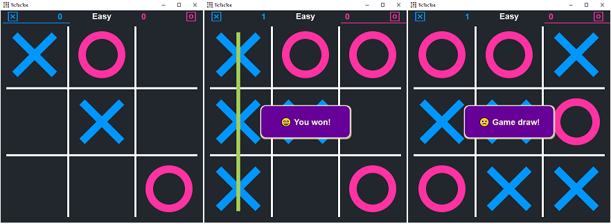

# TicTacToe

This is a simple gui TicTacToe game implemented in C++.



## Features

- Minimax algorithm implementation with Alpha-Beta Pruning mode
- Simple GUI interface using Direct2D
- Easy to understand code structure (hopefully)

## Requirements

- C/C++ compiler I use mingw-w64ucrt [here](https://winlibs.com/)
- Make simply rename mingw32-make.exe to make.exe in ..GCCx64/bin.
- Resource editor I use [ResEdit](http://www.resedit.net) (look for mirrors if the link is broken).
- VS Code or any code editor of your choice.

## Installation

1. Clone the repository:
    ```sh
    git clone https://github.com/AboSohyle/TicTacToe.git
    ```
2. Navigate to the project directory:
    ```sh
    cd TicTacToe
    ```
3. Compile the code:
    ```sh
    make release
    ```

## Usage

Run the executable:
```sh
./tictactoe
```

Use left click to play or right click to reset the game.

## Contributing

Contributions are welcome! Please fork the repository and submit a pull request.

## License

This project is licensed under the MIT License. See the [LICENSE](https://opensource.org/license/mit) file for details.

## Contact

For any questions or suggestions, please open an issue.
